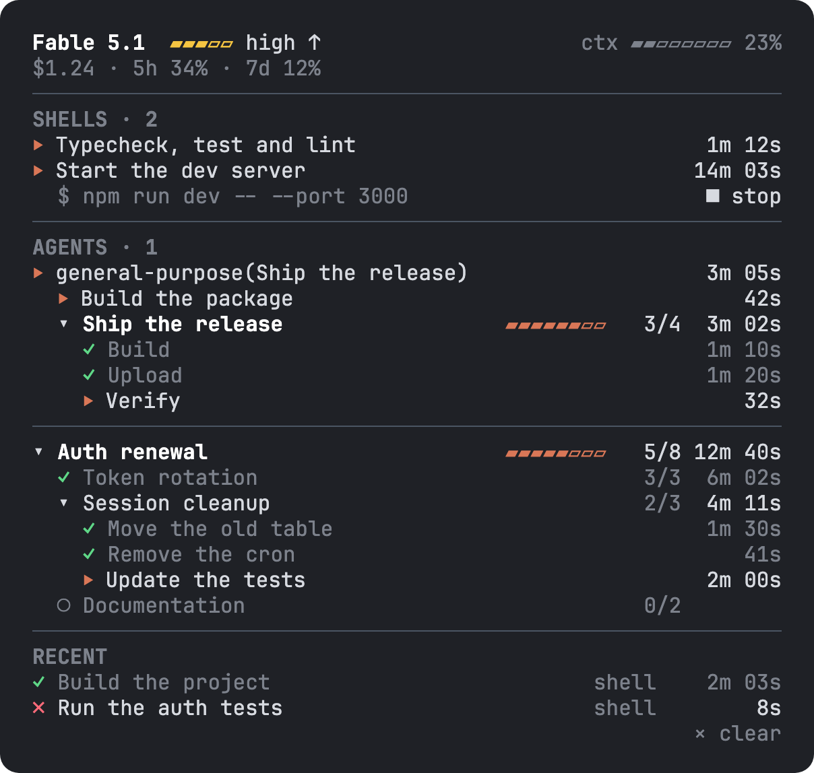
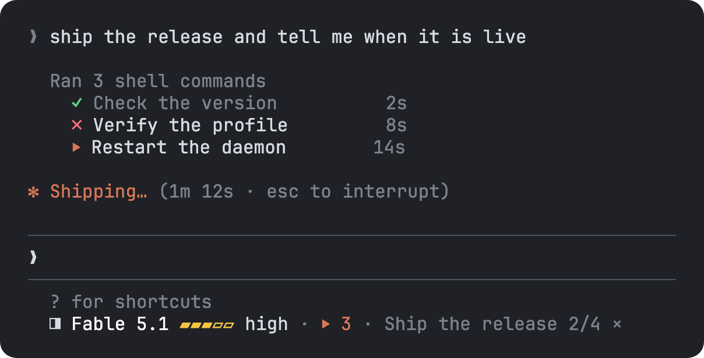

# claude-deck

A pane beside the conversation in [Claude Code](https://claude.com/claude-code) for the work behind it: the shells and agents that run, the model, an effort meter you can press, and the steps of each job as a tree.

Type `/deck`, or press its mark, `◨`, under the prompt:



## Install

```sh
claude plugin marketplace add barisdemirhan/claude-mods
claude plugin install deck@claude-mods
```

Restart Claude Code, then run `/deck`.

The same two steps work from inside a session with `/plugin marketplace add barisdemirhan/claude-mods` and `/plugin install deck@claude-mods`.

[claude-mods](https://github.com/barisdemirhan/claude-mods) is one marketplace for all of these mods, so its first line is needed once for the lot.

### If you installed from `claude-deck`

Nothing has to change. This repository is a marketplace of its own too, and `deck@claude-deck` goes on getting updates. Keep one of the two installs, not both: with both on, every hook runs twice.

## Use

| Command | What it does |
| --- | --- |
| `/deck` | Opens the pane, or closes the open one. `/deck open` only opens it. It asks for 52 columns beside the conversation; a width you drag it to stands. Opened by you, with a command or a press, it is drawn at any width: beside the conversation in the fullscreen layout from 110 columns, else above the prompt. Where Claude Code still keeps it waiting undrawn (a surface that draws no panes), the answer or a toast says why |
| `/deck watch` | With **GitHub checks** on, follows the checks of the branch you are on. `/deck watch 12` follows a pull request, and a workflow run's id, a branch, a commit or a page's address on GitHub works the same. `/deck unwatch` stops following; the runs stay where they stood. See [GitHub checks](#github-checks) |
| `/deck clear` | Takes what is over out of the pane: the ended shells and agents, and the runs that finished or stopped. What still runs stays |
| `/deck row` | Keeps the label as text on the hint line, or brings its row back. The row's `×` does the first. Every open session follows within two seconds |
| `/deck close` | Takes the deck away in every open session within two seconds: the label, the pane, the reading of shell calls, what it follows on GitHub and the effort it set. What was running ends where it stood, since the deck sees no end while it is closed. `/deck exit` and `/deck quit` do the same; `/deck` brings it back |

### The label

Under the prompt the deck keeps one label: the model, its effort, how many shells and agents run, and the job under way with its steps done.



Where there is a pointer, the terminal's fullscreen layout or the desktop app, the label is a row of its own right under the hint line, and it begins with the deck's mark, `◨`: a press on it opens or closes the pane, and so does a press on the run at the row's end. The model's name between them is plain text. Its effort is drawn in its level's color, and a press on the level's name steps it up, as on the pane's meter. What runs has the color of a running row, a failed step's `✗` is red, the rest is dim. `×` closes the row: the label is then text on the hint line. Where another mod has already drawn a row of its own there, the label joins that row at its end, so the two take one row between them. The row fits what the screen leaves it beside the docked pane and another mod's row: the run's title is cut first, then the model's name goes, then the run, so `×` stays on the screen. A shell Claude Code asks you about is not counted as running. The model follows `/model` within two seconds; its effort shows again with its first request. On the terminal's main screen it is text at the end of the hint line. The **Hint label** setting keeps it text everywhere, or takes it off.

### The pane

| Part | What it shows |
| --- | --- |
| The first rows | The main thread's model, its effort meter, and how full the context window is. Under them what the session cost and how full each rate limit is (`$1.24 · 5h 34% · 7d 12%`); above the prompt, where the pane has few rows, these share the first row while it has room |
| `SHELLS` and `AGENTS` | Each shell command and each subagent that runs now, in a section of its own, with how long it has run. Each row starts with `▸` closed or `▾` open, before its state mark. A title too long for its row is cut with `…`. A shell is named by what its call says it does, or by the first line of its command where the call says nothing; a subagent by its type and task, as `general-purpose(Ship the release)`. At its row's end a subagent shows its model and its effort, `Sonnet ▰▰▰▱▱`: the model's first word as its start named it, then the effort's bar in the level's color once its first request carried one. A narrow pane keeps the name and leaves out the bar. What a running agent started, its own shells and agents and the run it opened, is drawn under its row. A shell Claude Code asks you about shows `?` and `waits`, with no clock, until it runs: its time starts when it does, two seconds before Claude Code draws its ctrl+b hint under it |
| The runs | Each job's steps as a tree, between the two lists. See below |
| `RECENT` | The last eight that ended: `✓` done, `✗` failed, `■` stopped, `·` ended with no word on how. A foreground command that went well in under three seconds is left out. Above the prompt the newest three are listed and the rest counted, `+5 more` |

A press on a row's mark or title opens its detail under it, and another closes it. If the title was cut, its full text comes first, wrapped over as many lines as it needs; a title that fits is not repeated. Under that is a shell's command, its first line, wrapped and bounded to eight lines' worth of characters with a final `…` where it is cut, or an agent's model and effort. An open title is no longer dim. Where the job runs in the background, a line under the detail has a `■ stop` button, which asks Claude Code to stop that task as its own TaskStop tool does. `× clear` on the pane's last line does what `/deck clear` does. What is over also leaves the pane by itself after half an hour.

A shell that Claude runs in the background, or that a timeout or ctrl+b moves there, stays under `SHELLS` until Claude Code reports its end. That report waits for the tool call Claude is in, so a background shell's time can read longer than it ran.

### Transcript rows

Where Claude Code folds a run of tool calls into one line of the conversation, the deck adds a row under it for each shell command of the group:

```
Ran 3 shell commands
  ✓ Check the version           2s
  ✗ Verify the profile          8s
  ⏵ Restart the daemon         14s
```

Each row is that call's own: matched by the call's id, in the order Claude made them, with the state the transcript gives it. A command that went to the background keeps `⏵` and its time until it ends, its time running whether the pane is open or not. A title is cut to the conversation's width beside a docked pane, and to 56 cells at most. A press on a title opens the pane with that command's row open. Past four commands the rest are counted, `+2 more`. Claude Code's own line stays as it is, other tools get no row, and a group you expand with ctrl+o is left alone. The **Transcript rows** setting turns them off.

### Runs

A run is one job's steps, with how many are done and how long each took. The deck keeps the last six. When the subagent that opened a run ends, the run's clock stops and a step it left running goes back to waiting. When an agent opens a new plan, the one it had under way stops the same way: the agent moved on, and nothing would end it.

A loop shows one run at a time: when an agent opens a plan, the task list it was following leaves the pane, and its later tasks open none while the plan is under way. `/clear` takes every run away with the conversation.

- **Claude Code's own task list** shows as a run by itself: when Claude makes tasks and moves them along, as it already does, each task is a step. A list is flat, one level.
- **A plan with levels** needs the **Tool for Claude** setting, below.

The run under way is open, and the others are one row each. Inside a run, a branch is open while it is under way and folds by itself before it starts and once it is over. A press on a row's mark folds or unfolds it: `▾` open, `▸` folded. A step that failed is a red `✗`, and so is every branch above it, so a folded run still shows it. A run a subagent opened carries the agent's name: `Ship the release · general-purpose`.

A step whose title does not fit has its own `▸` / `▾` mark beside its state. A press on that mark or the cut title opens the full title wrapped under it; a step that fits stays one line.

Only the steps at the ends of the tree have a state. A branch's state, its count and its time come from the steps under it.

### Tool for Claude

With **Tool for Claude** on, Claude can call two tools:

- `plan` takes a job's title and its steps as indented text, one step a line, and opens a run. Each line gets an id from its place: `1`, `1.2`, `1.2.1`.
- `step` moves one step: `start`, `done` or `fail`. Starting a step ends any step still running before it in the plan, in the same branch or an earlier one, so moving on is one call. The first step starts with the plan, and a subagent's last step is done by itself when the agent answers, so a job of three stages costs an agent four calls: one to load the tools, the plan, and two moves. The note below also tells agents to skip the tree for a short job. The deck keeps the times; Claude never sends one. An agent moves its own plan; another's only by naming its run.

Every agent of the session gets them with that one setting: the main thread and each subagent alike, of any type, with no line added to an agent's definition. So that an agent uses them without being asked, the same setting adds one note, the same words in two places: as a section of the main thread's system prompt, and at the end of the task each subagent is given.

> The person follows progress in a pane called Deck, which shows them the title and steps of a plan and the description of each shell command you run. They read these to understand what is happening: write them in the language the person writes in. If you have the tool mcp__deck__plan and this job will take more than a couple of minutes or more than three stages, call it once as you begin with three to six steps (load it and mcp__deck__step with ToolSearch if their schemas are not loaded); its first step starts by itself, so call mcp__deck__step only as you move to the next one. Skip it for a short job: each call costs the person a round trip.

The note also asks for the words you will read in the pane, a plan's title and steps and each shell command's description, in the language you write in. A tool's description alone does not do this: where many tools are installed, Claude Code lists most by name only, and an agent reads a description only after it loads the tool. You can still ask, "plan this in the deck". The one agent that cannot is one whose definition lists its `tools` and leaves these two out: Claude Code refuses it any other tool. Claude Code asks your permission for them as for any tool, and their descriptions take a little of every prompt's context, which is why they are off by default.

### GitHub checks

With **GitHub checks** on, the deck follows checks on GitHub and shows them as a run: the CI of a pull request, a deploy or any other workflow run, the checks of a branch or a commit.

```
▾ PR #12 · Fix the wallet            ▰▰▰▰▰▱▱▱ 3/5    4m 10s
    ✓ lint                                              41s
    ✓ unit                                           2m 03s
    ⏵ e2e                                            3m 20s
    ✗ deploy/preview                                    12s
    ○ smoke
```

| You give | It follows |
| --- | --- |
| `12`, `#12`, or a pull request's address | That pull request's checks: its check runs, and the statuses other services set on its last commit |
| A workflow run's id or address | That run's jobs, each with its steps under it |
| A branch, a tag, a commit, or the address of one | The checks of that commit; for a branch, of its newest one |
| Nothing | The branch the session is on |

A number of eight digits or more is read as a workflow run's id, a shorter one as a pull request's. A check that was skipped, cancelled or timed out says so beside its name; a skipped one counts as passed.

The deck asks GitHub every 30 seconds while something is followed, four things at most. A pull request's or a commit's checks are over once two polls in a row find each one over, since a later workflow may still add its own; a workflow run is over when GitHub says so. A watch is given up when no check shows up in ten minutes, when no check moves for half an hour while none runs (a job that waits on a runner or an approval may wait for good; one that runs holds the watch however long it takes), after two hours in all, or when GitHub does not answer five times in a row: its run stops where it stands, a toast says why, and Claude is told where it asked to be woken. One question to GitHub may take 20 seconds. A toast tells you of a failed check and of the end, as for any run.

**How it asks.** With the [`gh`](https://cli.github.com) command installed and signed in, the deck runs `gh api` for each question, so it holds no token and a company's own GitHub host works. Where there is no `gh`, or nobody is signed in to it, it asks `api.github.com` directly: with the token in `GH_TOKEN` or `GITHUB_TOKEN` where one is set, and with none for a public repository, then every two and a half minutes, as GitHub answers a nameless caller 60 requests an hour. Every question is a read. A host other than `github.com` needs `gh`, and `gh` runs only where Claude Code runs commands for a mod, which is the terminal.

**For Claude.** The same setting lists one tool, `watch`, with a note that tells every agent of the session it is there, added as the note of **Tool for Claude** is:

> When you wait on GitHub checks (the CI of a pull request, a deploy or any other workflow run, the checks of a branch you pushed), call mcp__deck__watch once in place of polling in a shell (load it with ToolSearch if its schema is not loaded): the person follows each check in the Deck, and with wake you get a message when they are over.

`watch` takes what to follow, as `/deck watch` does, and `wake`. With `wake`, the deck submits one prompt of its own when the checks are over or the watch is given up, which starts a turn: how many checks passed and failed, the failed ones by name, and the page's address. So Claude can push, call `watch`, end its turn, and merge when the word comes, with no shell left polling. Without `wake` you see the checks and Claude is told nothing.

### The effort meter

`▰▰▰▱▱ high` is the effort the main thread's requests go out with, drawn in its level's color: low dim, medium green, high yellow, xhigh orange, max red. Press the level's name and it goes one step up: low, medium, high, xhigh, max, then low again. The name's button is as wide at every level as the longest name, so a pointer that stays where it pressed goes all the way round. From the next request on, the deck sends that level in place of Claude Code's own, on the main thread only; a subagent keeps its own. The mark beside the meter is `⟳` while the deck sets the effort and `↑` while Claude Code does.

It lasts for the session, until one of these hands the effort back to Claude Code: `/effort` with another level, a step that lands on Claude Code's own level, or `/deck close`. A model that takes no effort setting shows no meter.

## Settings

In Claude Code's `/config` menu, under the plugin's name:

| Setting | Default | What it does |
| --- | --- | --- |
| Hint label | `button` | `button`: a row under the hint line with parts you can press, where there is a pointer, and text elsewhere. `text`: always at the end of the hint line. `off`: no label |
| Tool for Claude | off | Lists the `plan` and `step` tools for Claude. See above |
| GitHub checks | off | Follows checks on GitHub as a run: `/deck watch`, and the `watch` tool for Claude. See above |
| Transcript rows | on | The rows under a group of tool calls in the conversation. See above |
| Toasts | on | A toast when a background job fails or ends after half a minute, when a step fails and when a run finishes |

## Requirements

- A Claude Code build with mod support (plugins that ship a hooks module). Built on 2.1.289 and tested on 2.1.295. Mods sit behind a rollout switch, so if `/deck` does not show up after installing, the switch may still be off for you.
- The terminal or the desktop app: the label and the pane are drawn only there. A press needs a pointer: the terminal's fullscreen layout or the desktop app. On the terminal's main screen the commands do it all.
- The pane fits its rows to the width it gets: a long title is cut first, and the context meter moves to a row of its own when the first row is full. Under 44 columns a run loses its bar and keeps its count; under 36 a row loses its `shell` or `agent`. The label's row and the transcript's rows fit the screen too, as told above.

## Privacy and data handling

The mod registers one slash command, adds one label under the prompt, adds rows under the conversation's lines for groups of tool calls, and draws its pane when you open it. Out of the box it reads no files, writes none, runs no processes and makes no network request; with **GitHub checks** on it runs `gh` and `git`, or asks GitHub directly, as told below. Out of the box it changes one thing of Claude's work, and only after you ask: the effort of the main thread's model requests, after a press on the meter. A press on a row's `■ stop` asks Claude Code to stop that one background task. With **Tool for Claude** on it changes one more: it adds the note quoted under that setting to the main thread's system prompt and to the end of each subagent's task. **GitHub checks** adds its own note the same way, and for a watch Claude asked to be woken for, the deck submits one prompt of its own when the checks are over. It never changes the prompt you type, a tool call or a tool's result.

**What it reads.** More than the other mods of this marketplace, which read no argument of a tool call:

- Of each `Bash` call: its `description`, cut to 80 characters, as the row's title, and the first line of its `command`, cut to 200, as the row's detail (and its title where the call has no description). Both are kept in memory until the session ends, eight newer rows push the row out, or half an hour passes. Of the call's result: whether it failed, whether it was interrupted, and the id of the background task it became. Not its output.
- Of a group of tool calls the conversation draws as one line: which of its calls are shell commands, and of those the id, the state, and the same `description` and first line of `command` as above. Of the group's other calls, the tool's name only, to pass them by.
- Of each `TaskStop` call: the id of the task that was stopped.
- Of each `TaskCreate` call: the new task's id and its subject, cut to 80 characters and kept in memory as a step's title. Of each `TaskUpdate` call: the task's id, its new status and, when it changes, its subject. Not a task's description.
- Of each subagent: its type, its name and the few words its call names the task with, and when its turn ends, how.
- Of each model request: the model, the effort, and whether a subagent made it. Not the conversation.
- Of the row Claude Code draws when a background task ends: the task's id, how it ended and how long it ran. Not the row's text.
- When Claude stops: the ids of the background tasks still running.
- When Claude Code asks you whether a shell may run: the tool's name and the first line of its command, to find that shell's row. Nothing else of the dialog, and not your answer.
- When Claude Code draws its ctrl+b hint under a shell: the call's id, which says the shell runs.
- From Claude Code: the main thread's model, how full the context window is, what the session cost and how full its rate limits are.
- With **GitHub checks** on, when a watch starts: the address of the session's `origin` remote, for the repository's host and name, and for a watch with no target the name of the branch you are on. Of GitHub's answers: a pull request's title; a workflow run's name, title and state; each check's, job's and step's name, state and times. The names are cut to 80 characters and kept in memory as a run. With no `gh`, the value of `GH_TOKEN` or `GITHUB_TOKEN`, to send it to GitHub with each question.

It reads nothing of a prompt's text, of any other tool's call, or of an answer.

**What it sends.** Out of the box, nothing: it makes no network request. It has no server, no account and no analytics, and nothing goes to the author of this mod.

With **GitHub checks** on, and only while something is watched, it asks GitHub, read only, every 30 seconds. What goes out is the question: the repository's owner and name, and the pull request's number, the workflow run's id, or the branch's or commit's name. With `gh`, the deck runs `gh api` and `gh` makes the request, to the host of your remote or of the address you gave, with the sign-in `gh` holds. Without `gh`, the deck itself requests `https://api.github.com`, and no other host, with `GH_TOKEN` or `GITHUB_TOKEN` as the request's authorization where one is set. `/deck unwatch`, `/deck close`, the checks' end or the session's end stops it; with the setting off it never starts. GitHub's own policy covers what it keeps of a request.

**What reaches Claude.** What `/deck` answers is a row of the conversation, as any command's output is: one fixed sentence saying what the command did. No title of a shell, an agent or a step is in it. Out of the box the mod gives Claude no tool. With **Tool for Claude** on, it lists two, and what they answer goes into the conversation the same way: `plan` answers the steps Claude itself sent, each with its id, and `step` the step's id and how many are done.

With **GitHub checks** on, what `/deck watch` answers names what is shown, with the pull request's or the workflow run's title, how many checks are over, and the page's address; an error of `gh` or of GitHub is answered as it came, cut to its first line. The `watch` tool answers the same to Claude. For a watch with `wake`, the prompt the deck submits carries the run's title, how many checks passed and failed, the failed checks' names and the page's address.

**What it keeps.** On disk, in the plugin's own Claude Code store, one JSON file under `~/.claude/plugins/store/`: whether you closed the deck with `/deck close`, and whether you closed the label's row. Everything else, the rows' titles and times, the runs and their steps, what you folded, the model and the effort you set, is in the session's memory and gone with it.

**Sound.** None.

**Files and processes.** It reads no files and writes none. Out of the box it runs no processes. With **GitHub checks** on it runs two commands, each by its arguments with no shell: `gh api --hostname <host> <path>` for each question to GitHub, and `git rev-parse --abbrev-ref HEAD` once for a watch with no target.

[PRIVACY.md](PRIVACY.md) is the same as a privacy policy, with what reaches Claude and how to take your data off.

### Hooks

Its hooks are in `hooks/register.tsx`:

- `session.start` registers the `/deck` command (with Tool for Claude on, the two tools, and with GitHub checks on, `watch`) and starts the one-second tick that follows another session's `/deck close`, asks Claude Code for the main thread's model and moves the open pane's clock, then passes the event on unchanged. With GitHub checks on, the same tick polls what is watched.
- `session.end` takes the runs and what is over out of the pane when `/clear` ends the conversation, and passes the event on unchanged.
- `command.run` answers only the `/deck` command. Other commands never reach it.
- `tool.call` on `Bash` notes the call's start, its title and its end; on `TaskStop` the task that was stopped; on `TaskCreate` and `TaskUpdate` the task and its state. Each passes the call on unchanged and answers what Claude Code answered. With Tool for Claude on, two more answer the mod's own `plan` and `step`, and with GitHub checks on one answers `watch`. A press on `■ stop` raises one `TaskStop` call of the mod's own, for the task of that row. No other tool reaches any of them.
- `agent.spawn` notes a subagent's type, task and id. It passes the spawn on unchanged; with Tool for Claude or GitHub checks on, with that setting's note added at the end of the subagent's task, a fork left out.
- `prompt.compose`, hooked only with Tool for Claude or GitHub checks on, adds each one's note as a section after the system prompt's own, which stay as they are.
- `turn.complete` notes the end of a subagent's turn. It passes the event on unchanged.
- `session.measure` reads Claude Code's own figures as they move: the context window's fill, the session's cost and the rate limits. It passes the event on unchanged.
- `classic.Stop` reads which background tasks still run, and passes the event on unchanged.
- `turn.step` reads the model and the effort of each request. For the main thread, while a level you set stands, it passes the request on with that effort; otherwise, and for every subagent's request, unchanged. It passes the response on as it streams.
- `ui.render` adds the label to the end of the hint line, or where there is a pointer draws it as a row under the line, keeping the line and what other mods drew with it. It draws the deck's pane, and only that pane. Under a group of tool calls it adds the shell commands' rows after the group's own line, which it draws as it came; an expanded group it passes on untouched. On a background task's notification row it reads the task's fields and draws the row as it came.

While the deck is closed with `/deck close`, each of these passes its event on without reading it, the tools answer that nothing is shown, the notes are added nowhere, and what was watched on GitHub is dropped.

The files under `tests/` run only under `claude plugin test`, and are never loaded in a session.

## Develop

```sh
git clone https://github.com/barisdemirhan/claude-deck
claude plugin validate claude-deck
claude plugin test claude-deck
claude --plugin-dir claude-deck
```

`hooks/register.tsx` holds the hooks that tie the mod to Claude Code, and every call it makes on Claude Code: the engine follows `$` into no function of another file. The other files are plain functions it calls:

- `hooks/work.ts`: the shells and agents, running and lately ended.
- `hooks/meter.ts`: the model's name and the effort meter.
- `hooks/runs.ts`: the runs, their steps and the rows they draw as.
- `hooks/checks.ts`: GitHub's checks: what a watch follows, the API's answers as checks, and the checks as a run.
- `hooks/tools.ts`: the tools Claude reads, as it reads them.
- `hooks/view.ts`: the label's text and the times.
- `hooks/pane.tsx`: the pane's drawing.
- `hooks/values.ts`: readers for values from outside.

[docs/DESIGN.md](docs/DESIGN.md) is the design, with what was checked against Claude Code before it was built.

## More mods

From the same marketplace, [claude-mods](https://github.com/barisdemirhan/claude-mods):

- [ambient](https://github.com/barisdemirhan/claude-ambient): a living band above the prompt, with sound, fed by Claude's work.
- [dino](https://github.com/barisdemirhan/claude-dino): a T-Rex runner in a pane, with Claude's tool calls as the obstacles.
- [pomodoro](https://github.com/barisdemirhan/claude-pomodoro): a pomodoro timer on the hint line whose break lands while Claude works.
- [tycoon](https://github.com/barisdemirhan/claude-tycoon): Token Tycoon, an idle game where Claude's tool calls earn the money.

## License

MIT
